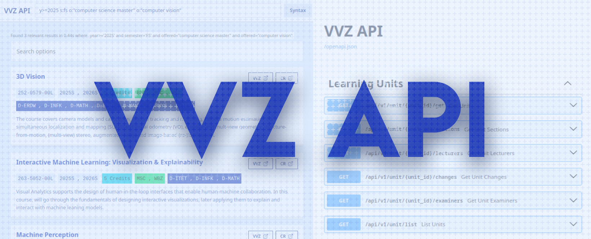

# VVZ REST API



#### Community-made simple search and REST API for [ETHZ's Vorlesungsverzeichnis](https://www.vvz.ethz.ch/Vorlesungsverzeichnis)

## Quick Start

Head to https://vvzapi.ch and start playing around with the search or API!

## Terms of Use

> [!NOTE]  
> This project is not affiliated with ETH Zurich in any way. It is a personal project that is not endorsed by ETH Zurich. The data is scraped from the public [VVZ](https://www.vvz.ethz.ch/Vorlesungsverzeichnis) website and is not used for any commercial purposes. The API is provided as-is and without any warranties. Use it at your own risk.
>
> This repository is licensed under the GPLv3 license. See [LICENSE](./LICENSE) for more information. Any forks must also be licensed under the GPLv3 license and made open-source if they are distributed.
>
> If you use the API or the downloadable database, I ask that you please credit the project and link back to the repository.
> I'm happy to see any projects that use the API and would like to link them here.

## Schema

The schema is inspired by the [VVZ Manual](https://www.bi.id.ethz.ch/soapvvz-2023-1/manual/SoapVVZ.pdf#page=18) (starts page 18).

Attributes have been translated to english, dropped (in cases where the value was internal and not visible on VVZ), or additional attributes have been added that were not present in the documentation.

The word choices might be confusing if you're not used to them. **Importantly, the term "unit" (or "learning unit" as the 1:1 translated from the German "Lerneinheit") is used for what is commonly understood as a course (Discrete Mathematics, Big Data, etc.).** "Unit" is the more general term, as VVZ also lists non-courses like thesis and other projects.

A unit can have multiple times and places it can take place at. These individual slots are called **"courses"** in the API (a somewhat loose translation of the German "Lehrveranstaltung").

## Search Design

The search is inspired by [Scryfall](https://scryfall.com/).

## Semester Status

> [!NOTE]  
> For some reason all semesters 2009-2019 (both S and W) are simply not available. Accessing any of them throws a 403 Forbidden. I wonder if this
> is just some short-term problem or if they'll never come back. Some of the data (for all courses) is available in the
> [Complete Catalogue](https://www.vvz.ethz.ch/Vorlesungsverzeichnis/gesamtverzeichnis.view?lang=en), but I currently do not have any plans
> of parsing data from PDFs.

## Versioning

This project uses semantic versioning. Breaking changes will result in a bump of the major version. There should not be any breaking changes to the endpoints of any endpoints that are the same or lower version than the major version. If the current version is `2.x.x`, the endpoints under `/v1` and `/v2` will not be _intentionally_ updated in a way that would break or completely change their usage. But `/v3` would then still be in prerelease and might change anytime.

---

## Contribution

The idea behind the VVZ API is to more easily enable the creation of various cool tools requiring course/VVZ data. If you have an idea for something that should absolutely be in the API, but is missing, open up an issue and let's start discussing it!

I'm grateful for any form of contribution, may it be adding documentation, implementing new features, opening issues for errors or something else. Head to the `Local Development` section below to learn more about how to get the API running locally.

---

## Local Development

Depending on what you intend to test locally, you can opt to download a dump of the database (head to the API docs to find the endpoint) to develop locally with the most up-to-date data.

Additionally, for ease of development, there is both a devcontainer (`.devcontainer/devcontainer.json`) and a mise (`mise.toml`) config that can help with setting up the local development environment. The devcontainer setup will initialze the essentials in a docker/podman container without cluttering your system with dependencies, while [mise](https://mise.jdx.dev/) installs packages into your shell environment and might be easier.

### Alembic Migrations

Locally, a SQLite database is used. Running the migrations automatically creates the database.

#### Run migrations

```sh
uv run alembic upgrade heads
```

#### Create revision

Required if any model was modified.

```sh
uv run alembic revision --autogenerate -m "message"
```

### Scraper

#### Create scraper

```sh
uv run scrapy genspider <scraper name> <scraper name>.py
```

#### Run scraper

```sh
uv run -m scraper.main
```

Or for just one of the spiders:

```sh
uv run scrapy crawl units
uv run scrapy crawl lecturers
uv run scrapy crawl ratings
```

#### Run in shell (for debug)

```sh
uv run scrapy shell "<url>"
```

#### Debug spider

```sh
# general syntax
uv run scrapy parse --spider=units -c <cb func> "<url>"
# scrape all units
uv run scrapy parse --spider=units -c parse_start_url "https://www.vvz.ethz.ch/Vorlesungsverzeichnis/sucheLehrangebot.view?lang=de&semkez=2003S&seite=0"
# scrape a single unit
uv run scrapy parse --spider=units -c parse_unit "https://www.vvz.ethz.ch/Vorlesungsverzeichnis/lerneinheit.view?semkez=2025W&ansicht=ALLE&lerneinheitId=192945&lang=en"
# scrape all lecturers
uv run scrapy parse --spider=lecturers -c parse_start_url "https://www.vvz.ethz.ch/Vorlesungsverzeichnis/sucheDozierende.view?lang=de&semkez=2026S&seite=0"
```

#### Cleanup html cache directory

There might be outdated or unused files in the html cache directories. Using the cleanup script everything that is not needed can be removed. Additionally it can also be used to purposely delete at most `amount` valid cached files from one or more `semester`s that are older than `age-seconds`.

```sh
uv run scraper/util/cleanup_scrapy.py [--dry-run] [--amount <int>] [--age-seconds <int>] [-d <semester>]*
```

#### Scrape locally

The scraper can also be started locally by running the docker image directly, if desired.

```sh
docker run \
    -e SEMESTER=W \
    -e START_YEAR=2024 \
    -e END_YEAR=2024 \
    -v $PWD/data:/app/.scrapy \
    markbeep/vvzapi-scraper:nightly
```

In the data directory there'll be a `httpcache` directory containing all crawled HTML files and a `scrapercache` directory containing scraper specific files and potentially a file called `error_pages.jsonl` with errors.

---

### API Server

```sh
uv run fastapi dev api/main.py
```

#### Tailwindcss

Tailwind is used in combination with [DaisyUI](https://daisyui.com). Download the source files using the following commands:

```sh
curl -sLo api/static/daisyui.mjs https://github.com/saadeghi/daisyui/releases/latest/download/daisyui.mjs
curl -sLo api/static/daisyui-theme.mjs https://github.com/saadeghi/daisyui/releases/latest/download/daisyui-theme.mjs
```

Then run tailwindcss:

```sh
tailwindcss -i api/static/tw.css -o api/static/globals.css --watch
```

### Type Check

```sh
uv run basedpyright
```

---

## Benchmarking

Website can be benchmarked with lighthouse or k6 locally.

### Lighthouse

Can be used to test SEO and generally if the website form is correct.

```sh
just lighthouse /unit/193444
```

### K6

Can be used to benchmark the website.

```sh
k6 run --vus 50 --duration 5m k6.js
```

### JaegerUI

OpenTelemetry can be used for more performance details and what slows down certain things.

JaegerUI can be started up with the following command (runs a docker container):

```sh
just jaeger
```

In your local `.env` file you want to add the following line:

```sh
JAEGER_ENDPOINT=http://localhost:4317
```

The jaeger UI can be viewed under http://localhost:16686

NOTE: This works well in combination with K6 to stress test the endpoints.
